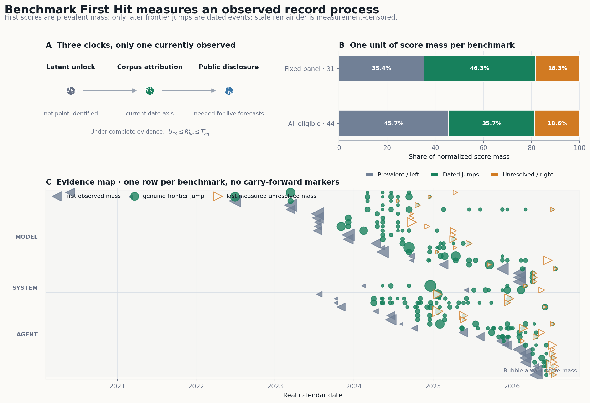
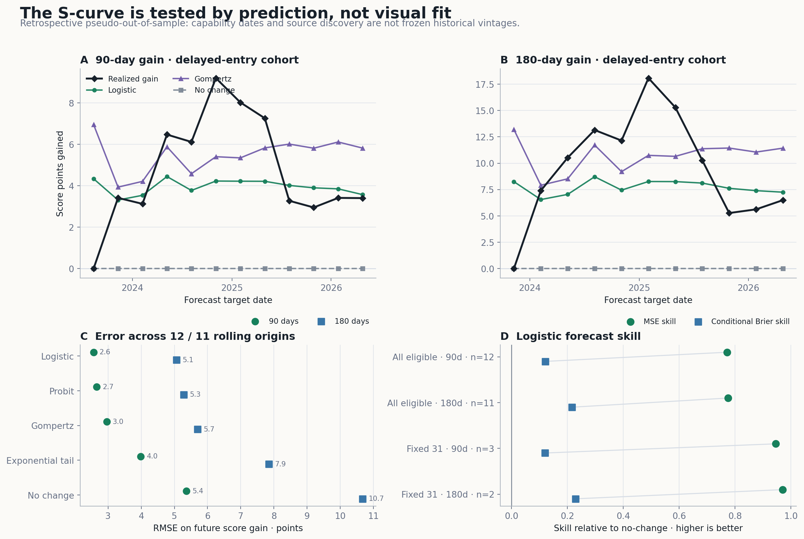
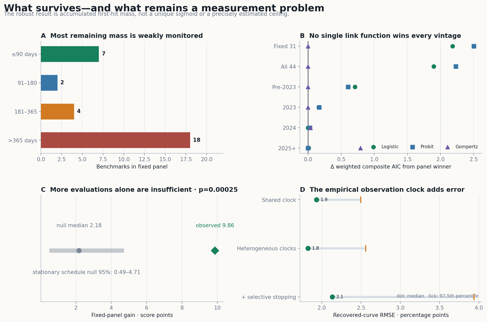

# Benchmark First Hit: Capability Diffusion Under Selective Measurement

## Abstract

Charts of frontier AI benchmarks mix technical progress, benchmark entry,
selective evaluation, and retrospective back-testing. We define a fixed-version,
any-system **benchmark first-hit** index: every benchmark contributes one unit
of normalized score mass, and each score threshold is dated when it first
enters the observed model-and-agent frontier. The resulting equal-benchmark
composite is exactly the empirical CDF of score-threshold first-hit times.

We distinguish latent capability unlock \(U\), retrospective corpus attribution
\(R^{\mathcal C}\), and first public disclosure \(T^{\mathcal C}\). The current
712-observation corpus primarily estimates \(R^{\mathcal C}\), not latent
\(U\). An exposure-threshold model,

\[
F_U(t)=1-\mathcal L_G(A(t)),
\]

provides a common mathematical skeleton for EdgeBench's log-interaction-time
curves and calendar-time ecosystem frontiers, while a separate observation
hazard determines how much latent progress becomes visible.

Across 44 eligible benchmark editions, 45.7% of score mass is already present
at first observation, 35.7% appears in later dated frontier jumps, and 18.6%
remains measurement-censored. A locked 31-benchmark panel rises 9.86 points
from 2025-08-07 to 2026-07-09. In a final-corpus, delayed-entry retrospective
backtest, a logistic model obtains 90/180-day RMSE of 2.56/5.07 points versus
5.37/10.68 for no-change over 12/11 origins. This is pseudo-out-of-sample:
historical corpus vintages were not frozen. In sample, Gompertz is slightly
preferred to logistic, and the winning link changes across benchmark vintages.
A schedule-preserving stationary-score null produces a gain at least as large
as observed with \(p=0.00025\), but 18/31 fixed-panel benchmarks have not been
comparably measured for more than a year.

The robust empirical claim is accumulated, forecastable first-hit score mass.
The data do not identify a unique sigmoid, a stable asymptotic ceiling, or
continuous learning by any single model.

## 1. Problem and contributions

The project asks a narrow question:

> When did a fixed amount of benchmark score mass first enter the best observed
> frontier of any model-and-agent system?

It makes three contributions.

1. **An estimand.** The average of fixed benchmark frontiers is exactly a CDF
   of score-threshold first-hit dates.
2. **A theory.** Heterogeneous thresholds under cumulative exposure can produce
   both within-run log-time curves and calendar-time ecosystem curves, while a
   separate detection process explains stale or selectively measured
   benchmarks.
3. **An empirical test.** Continuous score mass, censoring-aware
   quasi-likelihoods, rolling forecasts, cluster resampling, matched schedules,
   and record-process nulls replace a single attractive in-sample fit.

This is deliberately not titled a universal “law of AI progress.” A low
dimensional law earns that name only if it transfers to future, source-frozen
data.

## 2. Estimand

### 2.1 What is held fixed

The system frontier permits any base model, reasoning budget, tool stack, agent
scaffold, ensemble, or test-time-compute strategy. Those are part of the
technology being measured.

Comparability instead requires:

- the same benchmark edition and evaluated task set;
- the same metric direction, denominator, and substantive meaning; and
- no version or subset break that changes the target.

ARC-AGI-1/2, MATH/MATH-500, AIME 2024/2025,
OSWorld/OSWorld-Verified, and SWE-bench Full/Verified are therefore separate
series. Pass@1 is not joined to pass@64.

### 2.2 Three clocks

For benchmark \(b\) and threshold \(q\), define:

\[
\begin{aligned}
U_{bq}
&=\text{first latent availability of a system capable of }q,\\
R^{\mathcal C}_{bq}
&=\text{earliest system date assigned by frozen corpus }\mathcal C,\\
T^{\mathcal C}_{bq}
&=\text{first verified public disclosure in }\mathcal C.
\end{aligned}
\]

Ideally,

\[
U_{bq}\le R^{\mathcal C}_{bq}\le T^{\mathcal C}_{bq}.
\]

The dataset's `date` field is primarily a retrospective system-availability or
submission date, with `date_basis` retaining its semantics. A score discovered
in a later back-test can therefore be assigned before the benchmark existed.
The main result is a **corpus-attributed retrospective frontier**.

A true real-time forecast must use \(T^{\mathcal C}\) and freeze what was known
at every forecast origin. Missing disclosure dates remain NA; they are not
silently replaced by release dates.

### 2.3 First-hit identity

Let \(m_b(\tau)\in[0,1]\) be benchmark \(b\)'s corpus frontier by date
\(\tau\). For \(Q\sim\mathrm{Uniform}(0,1)\),

\[
R_{bQ}^{\mathcal C}
=
\inf\{\tau:m_b(\tau)\ge Q\}.
\]

Then

\[
\Pr(R_{bQ}^{\mathcal C}\le\tau)
=
\int_0^1\mathbf 1\{q\le m_b(\tau)\}\,dq
=m_b(\tau).
\]

For equal benchmark weights,

\[
\boxed{
X^{\mathcal C}(\tau)
=
\frac1B\sum_{b=1}^{B}m_b(\tau)
=
\Pr_{B,Q}(R_{BQ}^{\mathcal C}\le\tau)
}.
\]

This identity is exact for any monotone frontier. It explains what the index
is, not why it has a particular shape.

### 2.4 What 0–100 normalization does

Every benchmark is mapped to its native percentage-like 0–100 support, so each
benchmark supplies one unit of score mass. This normalizes **range**, not
difficulty or discrimination. One percentage point on HLE is not asserted to
equal one point on MMLU.

An IRT-style overlap index, such as the [Epoch Capabilities
Index](https://epoch.ai/data/eci-documentation/methodology), can estimate a
latent cross-benchmark scale. It requires the same system configurations to be
measured across benchmarks. The present model and agent evaluation graphs are
not sufficiently connected under strict tool/scaffold/protocol identity, so
IRT is a future calibration layer rather than the headline index.

## 3. Theory

### 3.1 Capability thresholds

Under an IRT response model

\[
p_{mb}=\sigma[\alpha_b(C_m-D_b)],
\]

score threshold \(q\) corresponds to latent difficulty

\[
\theta_{bq}
=D_b+\frac{\operatorname{logit}(q)}{\alpha_b}.
\]

If \(C^*(t)\) is the best capability available by \(t\), then

\[
\boxed{
S(t)
=
\Pr_w[\theta\le C^*(t)]
=G_\theta(C^*(t))
}.
\]

Score mass is a threshold distribution; model-and-agent improvement supplies a
frontier capability clock; the observed S-curve is their composition.

### 3.2 Exposure representation

An alternative but compatible microfoundation assigns each threshold a
discoverability \(\lambda\):

\[
\Pr(U>t\mid\lambda)=e^{-\lambda A(t)}.
\]

For discoverability distribution \(G\),

\[
F_U(t)=1-\mathbb E_{\lambda\sim G}e^{-\lambda A(t)}
=1-\mathcal L_G(A(t)).
\]

If \(\lambda\sim\mathrm{Exponential}(1)\),

\[
F_U(t)=\frac{A(t)}{1+A(t)}=\sigma(\log A(t)).
\]

[EdgeBench](https://edge-bench.org/#lawanim) uses within-run interaction time
and obtains

\[
A_{\mathrm{run}}(t)\propto t^\beta,
\qquad
\frac{dx}{d\log t}=\beta x(1-x).
\]

A calendar logistic instead requires

\[
A_{\mathrm{eco}}(\tau)\propto e^{k\tau},
\qquad
\frac{dx}{d\tau}=kx(1-x).
\]

Calendar time itself is not logged. The substantive hypothesis is that the
logarithm of effective ecosystem exposure is approximately affine in ordinary
calendar time.

### 3.3 Selective detection

Let \(\rho_b(t)\) be the hazard that an already unlocked threshold is
comparably evaluated and publicly reported:

\[
\text{locked}
\longrightarrow
\text{unlocked but undetected}
\longrightarrow
\text{detected}.
\]

Then

\[
F_T(t)
=
\int_{-\infty}^{t}
\left[
1-\exp\left(-\int_u^t\rho_b(s)\,ds\right)
\right]dF_U(u).
\]

Low or declining \(\rho_b\) creates an observed plateau while latent progress
may continue. Retrospective back-testing can later move \(R^{\mathcal C}\)
backward. This is why benchmark freshness is part of the result, not a
footnote.

### 3.4 Non-identification

For any monotone \(0<X(t)<1\), setting

\[
A(t)=\frac{X(t)}{1-X(t)}
\]

produces an exact logistic exposure representation. Curve shape alone cannot
separate:

- exposure \(A\) from the threshold distribution \(G\);
- capability progress from more attempts;
- latent unlock from measurement and disclosure;
- a finite ceiling from a slow upper tail; or
- base-model, scaffold, tools, compute, contamination, and targeted effort.

The theory becomes falsifiable only when one clock, fitted on one subset,
predicts held-out benchmarks, vintages, sources, or future data.

## 4. Empirical design

### 4.1 Continuous score mass

For frontier points

\[
(d_1,s_1),\ldots,(d_K,s_K),
\qquad s_1<\cdots<s_K,
\]

one benchmark contributes:

\[
\underbrace{s_1}_{\text{left/prevalent}}
+
\underbrace{\sum_{j=2}^K(s_j-s_{j-1})}_{\text{exact assigned jumps}}
+
\underbrace{(1-s_K)}_{\text{unresolved/right}}
=1.
\]

No 0.1-point pseudo-samples are created. A jump of 20 points is one clustered
event carrying mass 0.20. Monthly carry-forward values are display states, not
new observations.

This also handles benchmark entry on real calendar time. A new benchmark's
first high score is left-censored prevalent mass, not an instantaneous new
unlock. Later frontier jumps remain on their actual calendar dates.

### 4.2 Candidate laws

We compare:

- logistic;
- probit;
- Gompertz;
- shifted exponential upper-tail / log-error;
- cure-logistic with a fitted unlockable fraction; and
- no-change for forecasts.

For CDF \(F_\theta\), the score-mass composite quasi-likelihood uses

\[
\ell_i(\theta)=
\begin{cases}
\log F_\theta(R_i), & \text{left-censored},\\
\log f_\theta(t_i), & \text{exact assigned event},\\
\log[1-F_\theta(L_i)], & \text{right-censored}.
\end{cases}
\]

The density terms use years as the fixed time unit. Weighted AIC is descriptive
because thresholds and releases are dependent. Benchmark-cluster bootstrap
and jump-level ablations expose that dependence.

### 4.3 Prediction and controls

Two retrospective backtests are reported:

- `fixed31_common_window`: all 31 benchmarks are present at every origin;
- `all44_delayed_entry`: the origin's active cohort is frozen through its
  target, while later benchmarks do not enter that forecast.

Forecasts condition on the origin score and predict the fraction of remaining
score mass hit in 90 or 180 days. We report point RMSE and a conditional Brier
skill score relative to no-change.

The controls are:

- a within-benchmark daily-score date permutation preserving evaluation volume;
- a jump-size/date pairing permutation;
- removal of the largest 1, 3, 5, and 10 jumps;
- benchmark-cluster bootstrap;
- real-calendar vintage fits; and
- simulations on the empirical evaluation schedules with benchmark
  heterogeneity and selective stopping.

## 5. Results

### 5.1 Corpus and censoring

The frozen corpus contains:

- 712 sourced observations;
- 47 benchmark/version metadata entries;
- 44 series with an eligible frontier;
- 31 fixed-panel benchmarks;
- 202 post-baseline exact frontier events; and
- 44.0 total units of continuous score mass.

| Panel | Benchmarks | Left/prevalent | Dated jump mass | Unresolved/right | Measured within 365d |
|---|---:|---:|---:|---:|---:|
| Fixed comparable | 31 | 35.4% | 46.3% | 18.3% | 13/31 |
| All eligible | 44 | 45.7% | 35.7% | 18.6% | 26/44 |

The fixed panel has 18 benchmarks more than 365 days from their latest
comparable observation; its median measurement age is 425 days. Carry-forward
preserves an established first hit, but supplies no new evidence about
remaining thresholds.

### 5.2 Retrospective prediction

| Cohort | Horizon | Origins | Logistic RMSE | No-change RMSE | MSE skill | Conditional Brier skill |
|---|---:|---:|---:|---:|---:|---:|
| All eligible, delayed entry | 90d | 12 | 2.56 | 5.37 | 0.772 | 0.121 |
| All eligible, delayed entry | 180d | 11 | 5.07 | 10.68 | 0.775 | 0.216 |
| Fixed 31, common window | 90d | 3 | 0.72 | 3.09 | 0.945 | 0.120 |
| Fixed 31, common window | 180d | 2 | 1.08 | 6.26 | 0.970 | 0.229 |

The delayed-entry result is the more informative sample. The complete fixed
panel has only three 90-day and two 180-day origins and cannot support strong
model comparison.

These are **retrospective pseudo-out-of-sample** forecasts. The script truncates
rows by assigned capability date, but the final corpus contains source
discoveries and backdated evaluations that may not have been public at the
historical origin. A prospective result requires dated corpus snapshots or
`score_disclosed_date`.

### 5.3 Shape is not unique

On the full score-mass quasi-likelihood, Gompertz has the lowest weighted AIC:

- fixed 31: Gompertz 89.02, logistic 91.20;
- all 44: Gompertz 108.59, logistic 110.48.

The advantage is small, and the winning link changes by vintage:

| Real-calendar cohort | Winner | ΔAIC of logistic |
|---|---|---:|
| Pre-2023 | Gompertz | 0.71 |
| 2023 | Gompertz | 0.16 |
| 2024 | Logistic | 0.00 |
| 2025+ | Probit | 0.01 |

Removing the ten largest jumps leaves Gompertz as the in-sample winner for both
main panels. Yet logistic gives the best delayed-entry forecast RMSE. The
correct interpretation is a family of monotone S-shaped descriptions with
useful short-horizon structure, not one universally identified link function.

The cure-logistic drives its unlockable fraction to approximately one and loses
after its extra parameter penalty. By contrast, the earlier event-curve fit
found a local \(S_{\max}=86.42\) over an eleven-month upper-tail window. This
disagreement confirms that the old \(S_{\max}\) is a weakly identified local
asymptote, not an empirical ceiling on progress.

### 5.4 Nulls and measurement calibration

The locked fixed panel gains 9.86 points between 2025-08-07 and 2026-07-09.
Under 4,000 within-benchmark permutations of daily-best scores across their
actual evaluation dates:

- null median gain: 2.18 points;
- null 95% interval: 0.49–4.71;
- one-sided \(p=0.00025\).

This rejects a specific stationary-score record process with the observed
evaluation volume. It does not isolate learning from nonstationary reporting,
targeted effort, contamination, or changing system budgets.

Matched-schedule simulations show that the empirical observation clock is not
innocuous. Even under a clean shared logistic threshold process, the median
recovered-curve RMSE is 1.9 percentage points. With heterogeneous benchmark
clocks plus selective stopping, the median is 2.1 points and the 97.5th
percentile reaches 3.9 points.

## 6. What is and is not identified

The current analysis identifies:

- corpus-indexed assigned first-hit dates;
- an explicit equal-benchmark score-mass index;
- dated frontier-jump mass after the first observation;
- descriptive and retrospective predictive regularity; and
- sensitivity to several observed scheduling and record-process controls.

It does not identify:

- the latent unlock time \(U\);
- a causal learning rate;
- a unique exposure clock or threshold distribution;
- current capability on an unmeasured benchmark;
- a cross-benchmark semantic capability unit; or
- a stable finite \(S_{\max}\).

“No new measurement” is NA for latent capability, not failure and not zero
progress. “No new observed record” remains a legitimate public or corpus
first-hit statement only on its explicitly chosen date axis.

## 7. A decisive prospective test

The next version should:

1. freeze a benchmark panel and exact harnesses;
2. create a canonical `system_config_id` covering checkpoint, tools, scaffold,
   reasoning budget, sampling budget, and protocol;
3. store system availability, evaluation, and score disclosure dates
   separately;
4. evaluate declared frontier systems on a regular schedule, including stale
   benchmarks;
5. retain non-record results;
6. publish dated corpus snapshots; and
7. preregister 6- and 12-month forecasts before new scores arrive.

An overlap-calibrated IRT capability scale can then be estimated as a secondary
view. A genuine learning claim still needs a matched-budget stateful-versus-reset
intervention, of the kind EdgeBench uses within a run.

## 8. Conclusion

Benchmark First Hit is best understood as an event-time index of capability
records under selective measurement. EdgeBench provides an important special
case and theoretical inspiration: heterogeneous score units can aggregate into
a smooth log-time law. The calendar frontier has the same possible mathematical
skeleton, but a different clock, learner, and observation process.

The empirical result is promising but narrower than a universal scaling law:
fixed score mass enters the observed frontier in a structured and
retrospectively forecastable way. The scientific test is whether that structure
survives source-frozen future prediction.

## Primary sources

- Zhu et al., [*EdgeBench: Unveiling Scaling Laws of Learning from Real-World
  Environments*](https://arxiv.org/abs/2607.05155), 2026; [official
  explanation](https://edge-bench.org/#lawanim).
- Sevilla et al., [*A Rosetta Stone for AI
  Benchmarks*](https://arxiv.org/abs/2512.00193), 2025; [ECI
  methodology](https://epoch.ai/data/eci-documentation/methodology).
- Snell et al., [*Scaling LLM Test-Time Compute
  Optimally*](https://openreview.net/pdf?id=4FWAwZtd2n), 2024.
- Brown et al., [*Large Language Monkeys*](https://arxiv.org/abs/2407.21787),
  2024.
- Turnbull, [*The Empirical Distribution Function with Arbitrarily Grouped,
  Censored and Truncated
  Data*](https://rss.onlinelibrary.wiley.com/doi/10.1111/j.2517-6161.1976.tb01597.x),
  1976.
- Liang, Lu, and Ying, [*Joint Modeling and Analysis of Longitudinal Data with
  Informative Observation
  Times*](https://onlinelibrary.wiley.com/doi/abs/10.1111/j.1541-0420.2008.01104.x),
  2009.
- Blum and Hardt, [*The Ladder: A Reliable Leaderboard for Machine Learning
  Competitions*](https://proceedings.mlr.press/v37/blum15.html), 2015.
