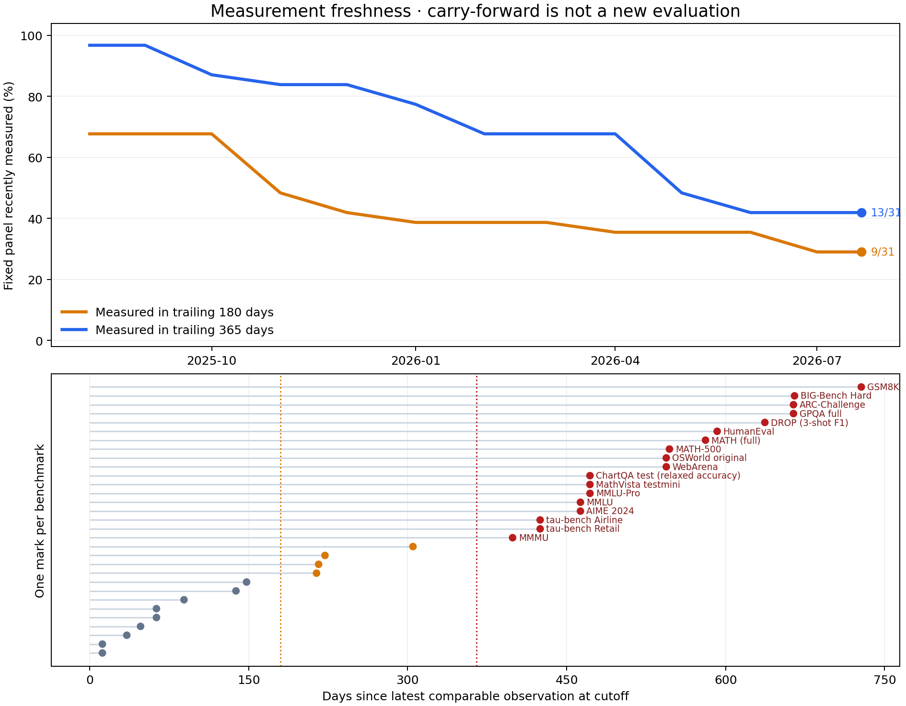

# Benchmark First-Hit

Benchmark First-Hit studies the best score reached by **any** model or agent on
fixed benchmark definitions over real calendar time. The curated corpus
currently contains **712 sourced observations across 47 benchmark/version
pairs**, through 2026-07-21.

This is a reproducible analysis of a curated history, not yet a claim of a
universal scaling law. The main result is encouraging, but measurement
coverage, retrospective dates, and benchmark dependence remain important.

## What is held fixed

The frontier is intentionally system-level. Any base model, reasoning budget,
tool stack, agent scaffold, ensemble, or test-time-compute strategy may set a
record. The hard comparability requirements are:

1. the benchmark edition and evaluated task set are unchanged; and
2. the metric, denominator, and score direction have the same meaning.

That is why ARC-AGI-1/2, MATH/MATH-500, AIME 2024/2025,
OSWorld/OSWorld-Verified, and SWE-bench Full/Verified are separate series.
Pass@1 is not joined to pass@64. Scaffold changes are retained and documented
because the object is the best available system, not an isolated base model.

Rows with an explicit version or subset mismatch remain auditable in the CSV
but have `frontier_eligible=0`. The analysis now fails fast if such a row is
accidentally made eligible.

## Two dates, two questions

There are two legitimate first-hit clocks:

| Clock | Date assigned to a score | Question answered |
|---|---|---|
| Public evidence | first verified score disclosure | What had the public record established by this date? |
| Retrospective capability | system release or submission date, including later back-tests | When did a system later shown to have this capability become available? |

The current primary `date` is the **retrospective capability date**.
`date_basis` records whether a row is contemporaneous, a leaderboard
submission, a publication date, or a retrospective release attribution.
Consequently, this repository must not be described as a pure
publication-first-hit history.

The audit currently finds 38 observations whose attributed system date predates
the benchmark release. These are meaningful retrospective back-tests, but they
were not observable first hits at the time. A future public-evidence analysis
needs a separately verified disclosure date for every such row.

## The first-hit identity and the learning hypothesis

For benchmark \(b\), let \(m_b(\tau)\in[0,1]\) be its best-so-far score on one
chosen date axis. If \(Q\sim\mathrm{Uniform}(0,1)\) and

\[
T_{bQ}=\inf\{\tau:m_b(\tau)\ge Q\},
\]

then, exactly,

\[
m_b(\tau)=\Pr(T_{bQ}\le\tau).
\]

The equal-benchmark composite is therefore the empirical CDF of first-hit
dates for a uniformly selected benchmark and score height. This is an identity
for any monotone frontier; by itself it does not explain the curve.

A candidate mechanism is heterogeneous threshold discoverability under
cumulative effective exposure \(A(t)\):

\[
\Pr(T>t\mid\lambda)=e^{-\lambda A(t)}.
\]

If \(\lambda\sim\mathrm{Exponential}(1)\), then

\[
x(t)=\frac{A(t)}{1+A(t)}=\sigma(\log A(t)).
\]

This connects the two settings the project is trying to explain:

- **EdgeBench / within-run learning:** if
  \(A_{\mathrm{run}}(t)\propto t^\beta\), then
  \(x(t)=1/[1+(t_{\mathrm{mid}}/t)^\beta]\), a sigmoid in log interaction
  time.
- **Calendar frontier:** if effective ecosystem exposure compounds so that
  \(A_{\mathrm{eco}}(\tau)\propto e^{k\tau}\), then \(x(\tau)\) is a sigmoid
  in ordinary calendar time.

So both can share an exposure–threshold structure, but only the within-run
setting directly supports a causal learning claim through retained-state versus
reset or matched-budget controls. The calendar frontier is evidence of
ecosystem-level cumulative innovation; it does not prove that one model
learned continuously.

The full derivation, alternative mechanisms, repeated-sampling null, censoring
model, and falsifiable predictions are in [THEORY.md](THEORY.md).

## EdgeBench-style construction

The aggregation follows EdgeBench's score convention:

1. Keep each benchmark on its native percentage-like 0–100 task scale.
   Random-chance floors are **not** subtracted.
2. Take the cumulative maximum separately for every comparable benchmark
   edition and metric.
3. Use a fixed panel and average benchmarks with equal weight.
4. Fit only genuine dates on which the composite changes. Monthly
   carry-forward states are exported for display, but are not treated as new
   independent evidence.
5. Compare linear score, log score, log remaining error, fixed-100 logit, and
   an Edge-style calendar sigmoid with fitted ceiling:

\[
S(\tau)=\frac{S_{\max}}
{1+\exp[-k(\tau-\tau_{\mathrm{mid}})]}.
\]

EdgeBench linearizes its within-run law by plotting
\(\log[S/(S_{\max}-S)]\) against \(\log t\). Calendar dates have no natural
zero, so this project instead tests whether the same fitted-ceiling log-odds
are linear in **raw calendar time**. \(S_{\max}\) is fitted rather than forced
to 100.

## Current result

| Fixed comparable panel | Benchmarks | Genuine composite events | Window | Start → end | Edge-calendar R² | Best by AICc |
|---|---:|---:|---|---:|---:|---|
| Equal-weight panel | 31 | 31 | 2025-08-07 → 2026-07-09 | 71.82 → 81.68 | 0.960 | Edge calendar |

The fitted calendar curve has \(S_{\max}=86.42\), \(k=1.68\) per year, and a
fitted-frontier-odds doubling time of about 151 days. Its AICc is -25.23,
compared with -19.71 for the strongest two-parameter baseline, log remaining
error.

The result survives several descriptive checks:

- A 400-replicate benchmark-cluster bootstrap gives Edge-calendar
  \(R^2\in[0.890,0.975]\), but the ceiling interval reaches the bound
  (\(S_{\max}\in[79.72,100]\)); the ceiling and long-range forecast are weakly
  identified.
- Leave-one-benchmark-out Edge-calendar \(R^2\) ranges from 0.943 to 0.969.
  Edge calendar wins AICc in 30 of 31 omissions.
- Under 4,000 within-benchmark date permutations, the stationary-record null
  has a median panel gain of 2.18 points and a 97.5th percentile of 4.71,
  versus 9.86 observed (\(p=0.00025\) with the finite-simulation correction).

This rejects that particular stationary record-process null; it is not proof
that technical learning is the only cause. Selective reporting, correlated
benchmarks, and nonstationary evaluation coverage can still matter.

The coverage diagnostic is the largest warning. At the 2026-07-21 cutoff, only
9/31 panel benchmarks had a comparable observation in the trailing 180 days
and 13/31 in the trailing 365 days; median measurement age was 425 days.
Carry-forward is correct for first-hit bookkeeping, but it is not a new
measurement of the remaining locked thresholds.

Across individual series, 39 of 44 eligible benchmark histories have at least
three genuine frontier events. Their best simple raw-score fits are
log-error for 20, log-score for 10, fixed-100 logit for 5, and linear for 4.
The calendar sigmoid is therefore not being claimed as a universal
per-benchmark functional form.




## New benchmark audit

This update adds 46 official-source observations across eight well-known
benchmarks:

| Benchmark | Added scores | Eligible frontier events | Fixed panel | Decision |
|---|---:|---:|:---:|---|
| DROP, 3-shot F1 | 5 | 4 | Yes | Stable task/metric chain across official model cards |
| ChartQA test, relaxed accuracy | 5 | 3 | Yes | Stable test split and relaxed-accuracy metric |
| MLE-bench v1 All, Any Medal | 14 | 14 | Yes | Official main leaderboard only |
| GDM-MRCR v2, 8-needle 128k average | 4 | 3 | No | Comparable individual series; too recent for the fixed panel |
| tau2-bench Retail, pass¹ | 5 | 3 | No | Comparable metric; recent and harness-sensitive |
| IFEval vendor aggregate | 5 | 0 | No | Vendors do not identify the same strict/loose aggregation |
| MMMU-Pro, no tools | 4 | 0 | No | Dataset revisions are not pinned to evaluated commits |
| FrontierMath Tiers 1–3 v1 private-290 | 4 | 0 | No | Exact set/scaffold uncertainty and a 10× token-budget break |

The excluded scores are still useful evidence: they show where more source
work or a clean new series is needed without silently forcing incomparable
numbers into the main maximum.

## Files and reproduction

- `data/benchmark_observations.csv`: sourced scores, date semantics, protocols,
  tools/scaffolds, and frontier eligibility.
- `data/benchmark_metadata.csv`: exact benchmark editions, metrics, release
  dates, known breaks, and fixed-panel membership.
- `scripts/analyze.py`: validation, frontiers, event-time fits, coverage,
  benchmark bootstrap, leave-one-out analysis, stationary-record null, CSV
  exports, and figures.
- `output/`: generated detailed tables and plots. The public repository tracks
  only the four headline figures to stay compact.

Install dependencies and rebuild:

```bash
python3 -m pip install -r requirements.txt
python3 scripts/analyze.py
```

## Primary sources

- EdgeBench: [interactive law explanation](https://edge-bench.org/#lawanim),
  [paper](https://arxiv.org/abs/2607.05155), and
  [official code](https://github.com/ByteDance-Seed/EdgeBench)
- [SWE-bench official leaderboard](https://www.swebench.com/index.html)
- [ARC Prize leaderboard](https://arcprize.org/leaderboard)
- [HLE paper](https://arxiv.org/abs/2501.14249)
- [OpenAI simple-evals](https://github.com/openai/simple-evals) and
  [MLE-bench](https://github.com/openai/mle-bench)
- [Meta Llama model cards](https://github.com/meta-llama/llama-models)
- [Google DeepMind model cards](https://deepmind.google/models/model-cards/)
- [Anthropic transparency hub and system cards](https://www.anthropic.com/transparency)
- [tau2-bench](https://github.com/sierra-research/tau2-bench)
- [FrontierMath Tiers 1–3 v1](https://epoch.ai/benchmarks/frontiermath-tiers-1-3-v1)
- [GAIA](https://huggingface.co/spaces/gaia-benchmark/leaderboard),
  [WebArena](https://arxiv.org/abs/2307.13854),
  [OSWorld](https://arxiv.org/abs/2404.07972), and
  [BrowseComp](https://openai.com/index/browsecomp/)

## Important limitations

- The corpus is curated from official reports and leaderboards, not an
  exhaustive registry. The source-extraction process is not fully automated.
- Benchmark reporting is selective, and old or saturated benchmarks are often
  no longer measured.
- The primary time axis is revision-prone: later back-tests can revise the
  inferred capability history backward.
- Benchmark families and editions are correlated but currently receive equal
  weight as separate fixed tasks.
- The stationary permutation null preserves each benchmark's observed score
  distribution and evaluation count, but it cannot remove selection,
  contamination, or changing task-targeted effort.
- \(R^2\), AICc, and fitted \(S_{\max}\) are descriptive in-sample statistics.
  A strong scaling-law claim requires prospective, out-of-sample prediction on
  a regularly measured fixed panel.
