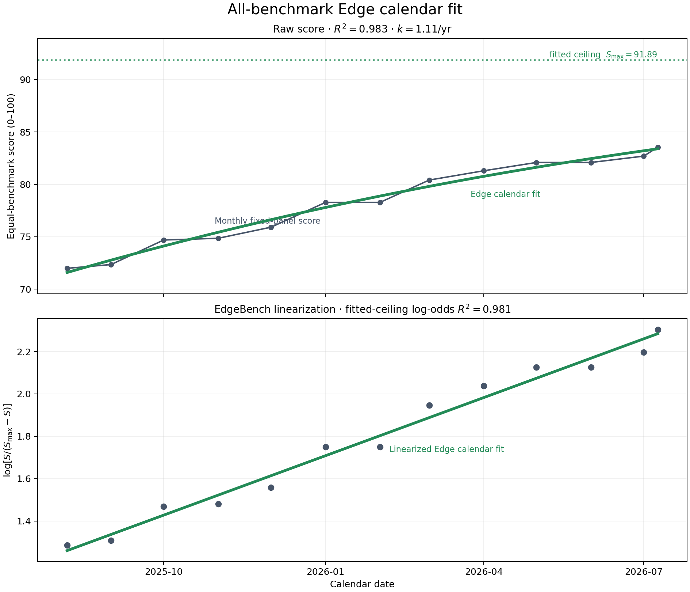
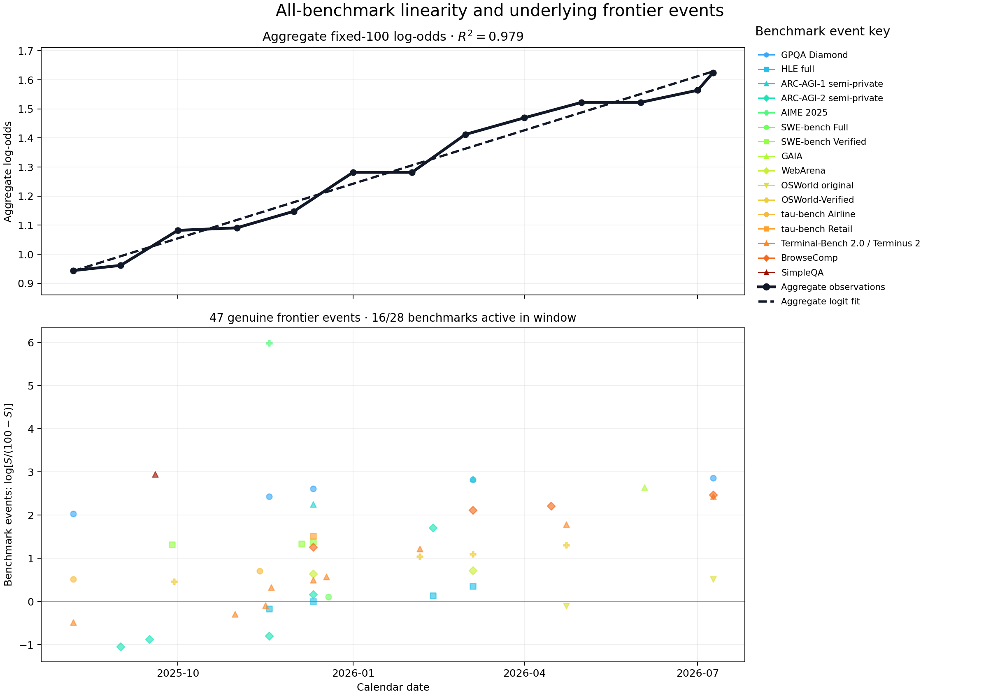
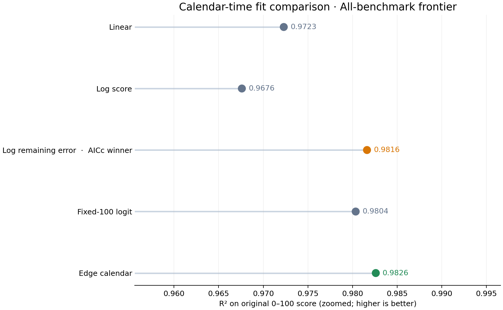

# Benchmark First-Hit

This is a reproducible history of **publicly demonstrated** AI progress.  It
contains 666 sourced observations across 39 benchmark/version pairs, current
through 2026-07-15.

The object of interest is not a particular model or leaderboard.  It is the
date on which each comparable score threshold is first publicly reached by any
model, agent, scaffold, ensemble, or test-time-compute strategy.

The main curve is deliberately **not** a fixed-model or fixed-scaffold curve.
For each benchmark, any model, reasoning budget, tool stack, agent scaffold,
ensemble, or test-time-compute strategy can set a new record.  The only hard
comparability requirements are:

1. the benchmark version/task set is unchanged; and
2. the reported metric and denominator have the same meaning.

That is why ARC-AGI-1/2, MATH/MATH-500, AIME 2024/2025,
OSWorld/OSWorld-Verified, and SWE-bench Full/Verified are separate series.
Pass@1 is not silently joined to pass@64 or consensus@64.

## The general first-hit theory

Let the historical frontier for benchmark `b` be

```text
x_b(d) = max score publicly achieved on or before calendar date d,
```

after mapping the score to `[0, 1]`.  Draw a score threshold `Q` uniformly from
`[0, 1]` and define its first-crossing date

```text
T_Q = inf { d : x_b(d) >= Q }.
```

Then, exactly,

```text
x_b(d) = P(T_Q <= d).
```

So every cumulative-best benchmark curve is an empirical CDF of score-threshold
first-hit dates.  This identity is the representation layer; it is not yet a
mechanism.

The candidate mechanism is heterogeneous discoverability plus cumulative
exposure:

```text
P(T_i > t | lambda_i) = exp(-lambda_i A(t)).
```

If score-atom discoverabilities are exponentially distributed,
`lambda_i ~ Exp(1)`, then

```text
x(t) = A(t) / (1 + A(t)).
```

The same mechanism produces two useful clocks:

- Within one long agent run, `A(t) = (t / t_mid)^beta` gives EdgeBench's
  log-time sigmoid:
  `x(t) = 1 / (1 + (t_mid / t)^beta)`.
- Across AI releases, if ecosystem R&D exposure is roughly exponential in
  calendar date, `A(d) = exp(k(d - d_mid))`, then `logit(x(d))` is linear in
  calendar date.

This is the generalization being tested here: training, inference compute,
tools, scaffolds, and agent engineering are all possible contributors to the
same effective exposure clock.  Exponential discoverability is only the
special case that gives an exact logistic; Gamma, lognormal, mixtures, and
moving ceilings imply other smooth CDFs.

## EdgeBench score convention

This project now follows EdgeBench's aggregation convention directly.  Each
benchmark/task score must first be on its own 0--100 task scale.  All selected
benchmarks already report a percentage-like 0--100 score, so:

```text
edge_score_b = clip(raw_published_score_b, 0, 100).
```

Random-chance floors are **not subtracted**.  A chance-adjusted score is kept
as an audit-only column, but it is not used by any frontier, composite, fit, or
plot.  This matches EdgeBench: task runs are rescaled to the task's 0--100
scale, task scores are averaged, and the theoretical normalization is
`x(t) = S(t) / S_max`, where `S_max` is a fitted attainable ceiling rather than
an assumed universal psychometric ceiling.

For each benchmark and public-evidence date:

```text
daily_best_b(d) = max eligible score published on date d
frontier_b(d)   = max_{u <= d} daily_best_b(u)
```

The primary composite is a fixed-panel, equal-benchmark arithmetic mean,
exactly mirroring EdgeBench's equal-task benchmark average.  It does not split
benchmarks into reasoning, multimodal, coding, or agent categories.  The first
composite date is the first date at which every benchmark in the panel has at
least one observation.  This avoids silently changing the index composition.

### Exact correspondence to EdgeBench `#lawanim`

The official animation first merges 134 tasks x 3 runs into a pointwise mean
on a common interaction-time grid.  It then fits

```text
S(t) = S_max / (1 + (t_mid / t)^beta),
```

and finally plots `log[S / (S_max - S)]` against `log(t)`, which is a line with
slope `beta`.  Crucially, `S_max` is fitted separately for every displayed
model and is not fixed to 100.

Our benchmark-history analogue is:

1. keep every comparable public system score as an observation;
2. take the best-so-far envelope separately for each benchmark version/metric;
3. sample those step curves on a common monthly calendar grid and average
   benchmarks with equal weight;
4. fit `S(d) = S_max / (1 + exp[-k(d-d_mid)])` and inspect
   `log[S/(S_max-S)]` against calendar date.

The last substitution is deliberate.  EdgeBench has a natural run origin, so
`log(t)` is defined.  Absolute calendar time has no non-arbitrary zero.  Under
the first-hit/exposure interpretation, exponentially growing ecosystem effort
makes log-odds linear in calendar date.  A literal log-time fit from a chosen
calendar origin is therefore reported only as a sensitivity analysis, not as
the primary law.

## Current result

Four two-parameter calendar-time baselines are compared on the original 0-100
scale (linear score, log score, log remaining error, and fixed-100 logit), plus
the three-parameter Edge calendar generalization with fitted `S_max`.  Fits use
a common monthly grid; AICc is reported so the extra ceiling parameter does not
win solely by construction.

| Fixed panel | Benchmarks | Events | Window | Start → end | Edge R² | Best by AICc |
|---|---:|---:|---|---:|---:|---|
| All-benchmark frontier | 28 | 22 | 2025-08-07 → 2026-07-09 | 71.99 → 83.54 | 0.983 | log-error |

The honest conclusion is **not** that a unique universal log-sigmoid law has
already been identified.  The single all-benchmark curve is visually very
straight in fitted-ceiling log-odds space (`R²` 0.981), and the raw-score Edge
calendar fit has `R²` 0.983 with fitted `S_max=91.89`.  However, after the AICc
penalty, the two-parameter log-error model narrowly beats the three-parameter
Edge calendar model.  This is strong evidence for a smooth first-hit CDF, but
not yet for one uniquely identified mechanism.

The dataset tracks all 39 benchmark editions.  The fixed real-calendar panel
uses 28 editions; 11 very recent editions are retained for individual analysis
but are not forced into the composite because their late start would collapse
the common calendar window to only a few months.  Of the 39, 35 have at least
three genuine frontier improvements and are shown in the benchmark-wise plot.
The four two-event histories remain in the data and summary table with
`best_fit=insufficient_points`, but are not plotted.  Among the 35 displayed
histories, the best raw-score fit is log-error for 20, log-score for 6, linear
for 5, and fixed-100 logit for 4.  The exact logistic is therefore not a
universal per-benchmark law in this snapshot.







## Files

- `data/benchmark_observations.csv`: all sourced observations, protocol fields,
  public-evidence dates, and eligibility for the max frontier.
- `data/benchmark_metadata.csv`: benchmark versions, chance floors, domains,
  known breaks, and source references.
- `scripts/analyze.py`: complete frontier construction, aggregation, fitting,
  CSV export, and chart generation.
- `output/edge_calendar_fit.png`, `output/edge_calendar_linearization.png`, and
  `output/composite_fit_comparison.png`: headline results.  The analysis script
  regenerates these plus the detailed diagnostic outputs.

Rebuild everything with:

```bash
python3 scripts/analyze.py
```

## Primary sources

- EdgeBench: [paper](https://edge-bench.org/paper.pdf),
  [score rescaling](https://github.com/ByteDance-Seed/EdgeBench/blob/main/sforge/harness/score_rescale.py),
  [best-so-far selection](https://github.com/ByteDance-Seed/EdgeBench/blob/main/sforge/harness/selection.py)
- [SWE-bench official leaderboard](https://www.swebench.com/index.html)
- [GAIA official leaderboard](https://huggingface.co/spaces/gaia-benchmark/leaderboard)
- [ARC Prize leaderboard](https://arcprize.org/leaderboard) and
  [2025 technical report](https://arxiv.org/abs/2601.10904)
- [HLE paper](https://arxiv.org/abs/2501.14249) and
  [Hugging Face benchmark leaderboard](https://huggingface.co/datasets/cais/hle)
- [MMLU](https://arxiv.org/abs/2009.03300),
  [MMLU-Pro](https://proceedings.neurips.cc/paper_files/paper/2024/file/ad236edc564f3e3156e1b2feafb99a24-Paper-Datasets_and_Benchmarks_Track.pdf),
  [GPQA](https://arxiv.org/abs/2311.12022),
  [GSM8K](https://arxiv.org/abs/2110.14168), and
  [MATH](https://arxiv.org/abs/2103.03874)
- [WebArena](https://arxiv.org/abs/2307.13854),
  [OSWorld](https://arxiv.org/abs/2404.07972),
  [tau-bench](https://github.com/sierra-research/tau-bench),
  [Terminal-Bench 2.0](https://www.tbench.ai/leaderboard/terminal-bench/2.0?agents=Terminus+2), and
  [BrowseComp](https://openai.com/index/browsecomp/)

## Important limitations

- Public benchmark scores are not a random sample; labs selectively report
  strong results.
- Release, evaluation, and leaderboard-submission dates are all retained in
  `date_basis`, but are only approximations to the true first-hit date.
- The frontier intentionally mixes base-model progress with tool use, scaffold
  engineering, ensembles, and inference compute.  It measures the best public
  system, not isolated model capability.
- Contamination and benchmark saturation remain real.  They are documented in
  metadata and notes rather than removed from the anything-goes frontier.
- After a benchmark's first observation, its public best-so-far score is carried
  forward.  A flat segment therefore means "no newly demonstrated first hit,"
  not "no latent capability progress."  Benchmarks without recent comparable
  evaluations are right-censored measurement processes, not evidence of
  capability stagnation.
- Four benchmark histories currently have only two record events.  They are
  retained for provenance but omitted from the per-benchmark curve plot and
  functional-form fitting until a third genuine improvement appears.
